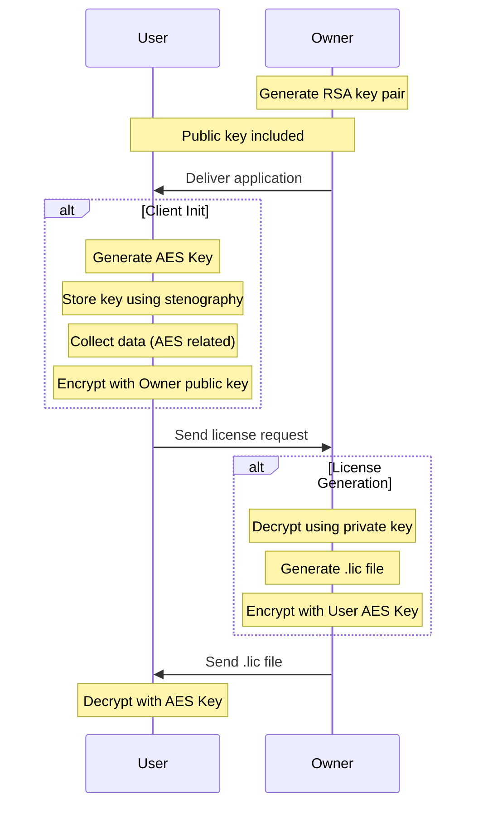

### License Client

 - #### What's this?
License Client is a small library supposed to handle license operations (read, request, validate, etc) for an application.
***

 - #### How it works?
The client installed on the application side will need to be fed with a license file to allow application usage.
The license file contains user-defined constraints for application usage. (name, version, expiry date, etc.)

The data exchange related to license operations: load and request is protected by encryption algorithms:
 - An RSA algorithm is used for key exchange between Client and Application Owner
 - An AES algorithm is used to encrypt the content of the license file
 - A poor LSB stenographic algorithm is used to store the AES Key on the client side.

The logic is represented by the following diagram:

***

 - #### Operation Modes:
The Client goal is having three operation modes:
 - Online
 - Standalone (Offline)
 - License Manager (not implemented)
 - ***