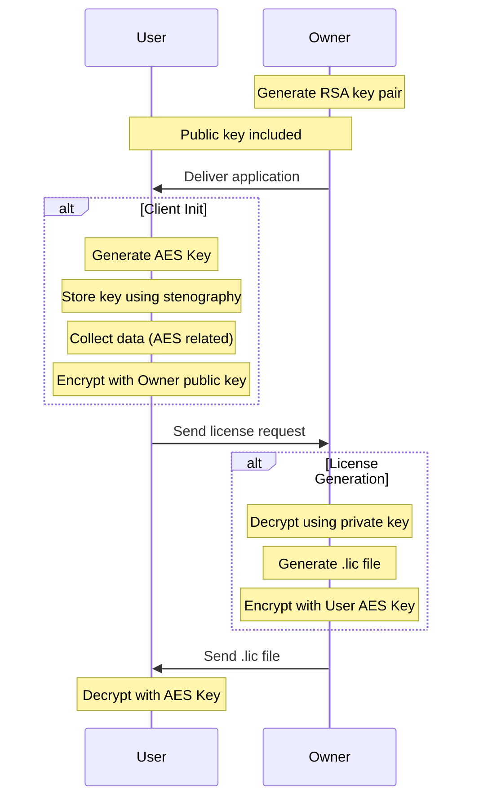
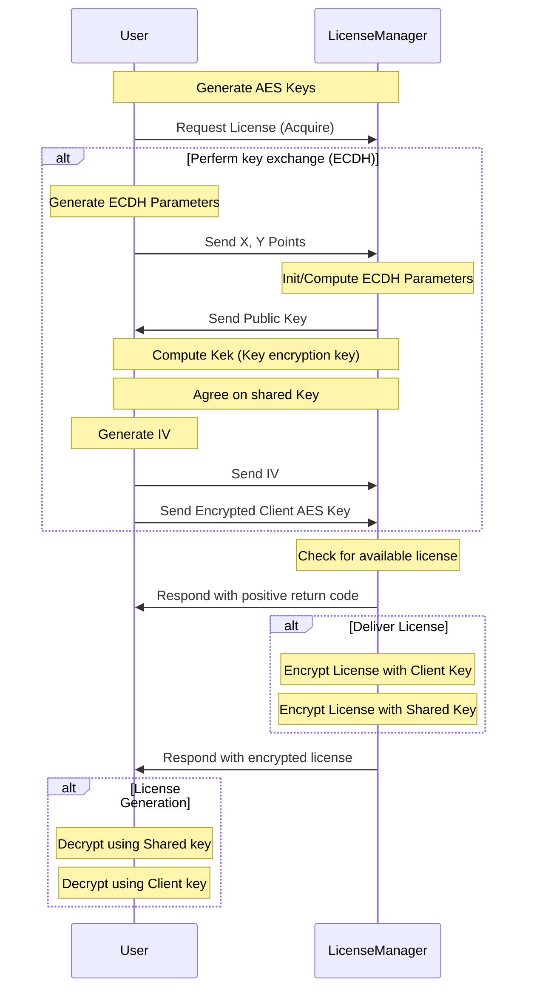

# License Client

 ## What's this?
License Client is a small library supposed to handle license operations (read, request, validate, etc) for an application.
***

## How it works?
The client installed on the application side will need to be fed with a license file to allow application usage.
The license file contains user-defined constraints for application usage. (name, version, expiry date, etc.)
The license file needs to be request from application provider side.
The data exchange related to license operations: load and request is protected by encryption algorithms according to Operation Mode.

At first use, client will generate it's own key that will be need to be provided to application provider side. This can be a file, a `POST` request or a socket payload depending on operation mode.
After license is created/generated on application provided side, this will be encrypted with client key and then forwarded back.

## Operation Modes:
The Client goal is having three operation modes:
- Standalone (Offline)
- Online
- License Manager (development ongoing)

### Security:
- An RSA algorithm is used for key exchange between Client and Application Owner
    - public key file should be delivered with application
    - private key file should be kept on provider side
- An AES algorithm is used to encrypt the content of the license file
    - Key is delivered via file which is encrypted with public key file
- A poor LSB stenographic algorithm is used to store the AES Key on the client side
    - Client key will be stored/read in/from a `png` picture

### Standalone Mode
#### Inputs:
 - License file (`.lic`)

The logic is represented by the following diagram:

***

### Online Mode
#### Inputs:
 - License Server
 - Serial Number

Online mode use same logic as `Standalone` mode excepting that key exchange is done via `POST` request to the configured server.

### License Manager Mode (development ongoing)
#### Inputs:
 - License Manager host ip
 - License Manager port
 - License files (`.lic`)

The logic is represented by the following diagram:

